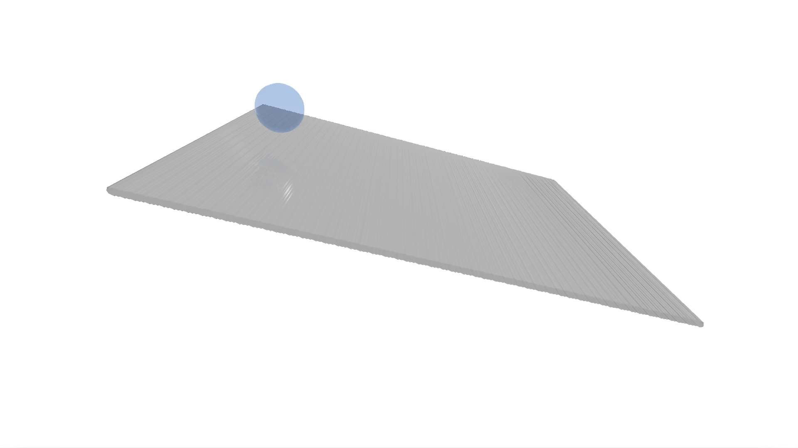
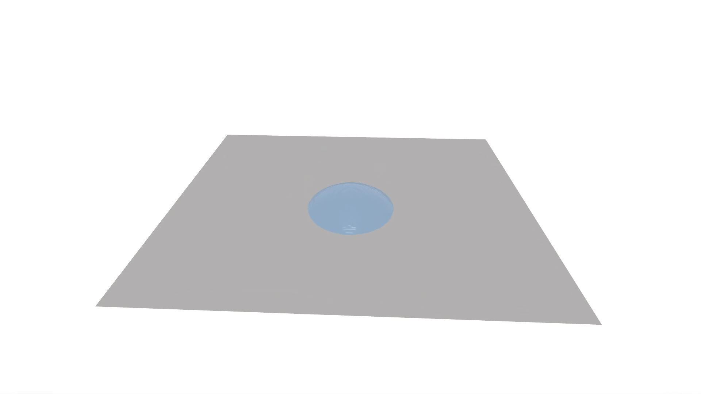
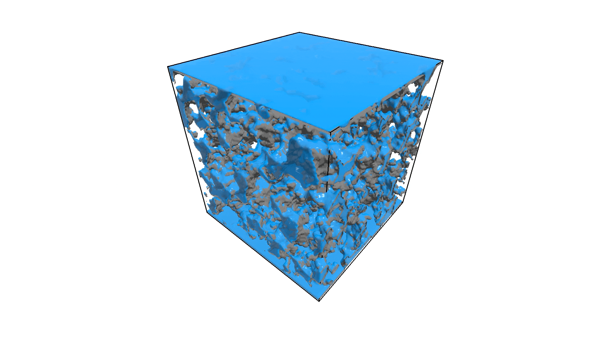

[](https://opensource.org/licenses/Apache-2.0)
# JAX-LaB: A Python-based, Accelerated, Differentiable Massively Parallel Lattice Boltzmann Library for Modeling Multiphase and Multiphysics Flows & Physics-Based Machine Learning

JAX-LaB is a fully differentiable, accelerated multiphysics and multiphase 2D/3D Lattice Boltzmann Method (LBM) Python library written in [JAX](https://github.com/google/jax) and it provides a unified workflow for forward and
inverse modeling of multiphase flows. JAX-LaB is an extension of [XLB](https://github.com/Autodesk/XLB) and adds support multiphase and multiphysics flows to the original library.

## Accompanying Paper
The accompanying paper, published in Journal of Advances in Modeling Earth Systems (JAMES), is available [here](https://doi.org/10.1029/2025MS005313).

## Showcase
<!-- <p align="center">
  
</p>
<p align="center" width="300">
  Capillary fingering in a channel (multi-component simulation)
</p>
<p align="center">
  
</p>
<p align="center" width="300">
  Capillary rise in parallel plates (single component, multiphase simulation)
</p> -->
<!-- <p align="center">
  
</p> -->
<p align="center">
<p float="left">
  
  
</p>
    Contact angle hysteresis: Left: droplet impinging on inclined surface (MRT collision model). Right: Droplet undergoing evaporation (Cascaded collision model). Simulated using Peng-Robinson EOS, geometric wetting.
</p>
<p align="center">
  
</p>
<p align="center">
    Time evolution of liquid distribution in a Fontainebleau sandstone during evaporation simulated using the Cascaded (central-moment) collision model.
</p>
<p align="center">
  
</p>
<p align="center">
  On GPU in-situ rendering using <a href="https://github.com/loliverhennigh/PhantomGaze">PhantomGaze</a> library (no I/O). Droplet impact on dry surface using MRT collision model with ~16 million cells.
  (single component, multiphase simulation, density ratio: 350, fluid modeled using Peng-Robinson EOS).
</p>
<p align="center">
  
</p>
<p align="center">
  In-situ GPU rendering of drainage in a porous geometry. BGK collision model, 110 million cells.
</p>
<!--<p align="center">
  
</p>
<p align="center">
<a href=https://www.epc.ed.tum.de/en/aer/research-groups/automotive/drivaer > DrivAer model </a> in a wind-tunnel using KBC Lattice Boltzmann Simulation with approx. 317 million cells
</p>

<p align="center">
  
</p>
<p align="center">
  Airflow in to, out of, and within a building (~400 million cells)
</p>-->
<p align="center">
  
</p>
<p align="center">
Temporal evolution of the density field determined using neural network for the inverse multiphase flow control problem of forming a droplet at t = 900. The MLP output is used as the initial condition for LBM and the backpropagation step during training leverages the auto-differentiation capabilities of JAX-LaB (see <a href="https://doi.org/10.1029/2025MS005313">paper</a> for details).
</p>
<br>

## Key Features
- **Integration with JAX Ecosystem:** The library can be easily integrated with JAX's robust ecosystem of machine learning libraries such as [Equinox](https://github.com/patrick-kidger/equinox) [Flax](https://github.com/google/flax), [Haiku](https://github.com/deepmind/dm-haiku), [Optax](https://github.com/deepmind/optax), and many more.
- **Differentiable LBM Kernels:** JAX-LaB provides differentiable LBM kernels that can be used in differentiable physics and deep learning applications.
- **Scalability:** JAX-LaB is capable of scaling on distributed multi-GPU systems, enabling the execution of large-scale simulations on hundreds of GPUs with billions of cells.
- **Support for Various LBM Boundary Conditions and Kernels:** JAX-LaB supports several LBM boundary conditions and collision kernels.
- **Support for Multiphase, Multiphysics and Multicomponent flows**: JAX-LaB can accurately model multiphysics and multiphase flows using Shan-Chen method, simulating complex interface dynamics without tracking any interface.
- **User-Friendly Interface:** Written entirely in Python, JAX-LaB emphasizes a highly accessible interface that allows users to extend the library with ease and quickly set up and run new simulations.
- **Leverages JAX Array and Shardmap:** The library incorporates the new JAX array unified array type and JAX shardmap, providing users with a numpy-like interface. This allows users to focus solely on the semantics, leaving performance optimizations to the compiler.
- **Platform Versatility:** The same JAX-LaB code can be executed on a variety of platforms including multi-core CPUs, single or multi-GPU systems, TPUs, and it also supports distributed runs on multi-GPU systems or TPU Pod slices.
- **Visualization:** JAX-LaB provides a variety of visualization options including in-situ on GPU rendering using [PhantomGaze](https://github.com/loliverhennigh/PhantomGaze).

## Capabilities
### Multiphase Flow Modeling
**Shan-Chen** pseudopotential method with various modifications:
- Support for **high density ratio flows** (tested for density ratios > 10<sup>8</sup>) using improved forcing scheme.
- Incorporates **Equation of State (EOS)** to model multiphase flows. Currently implemented EOS include **Carnahan-Starling**, **Peng-Robinson**, **Redlich-Kwong**, **Redlich-Kwong-Soave**
and **VanderWaals**.
- **Density ratio independent surface tension** control by directly modifying pressure tensor.
- **Improved wetting scheme** to handle large range of contact angles **without large spurious current or thick layers near solid surface**.
### Multicomponent Flow Support
JAX-LaB takes advantage of *pytrees* for computation hence, it can **model any number of components** (each with their own equation of state, initial condition and boundary conditions) without any user modification.

## Wetting model
- Wetting behavior of fluids can be modeled using the [geometric wetting scheme](https://journals.aps.org/pre/abstract/10.1103/PhysRevE.87.013301) and the [improved virtual density scheme](https://journals.aps.org/pre/abstract/10.1103/PhysRevE.100.053313) which avoids the need to include separate fluid-solid interaction forces commonly seen in Shan-Chen method by directly updating the near-wall densities.
- Wetting parameters can be passed by the user while defining the wall boundary conditions. By default, if no wetting parameters are specified, the boundary conditions are used as is without application of wetting behavior.

### Collision Models
- **BGK**
- **Multi-Relaxation Time (MRT)**
- **Cascaded Model**
- **KBC**

### Lattice
- D2Q9
- D3Q19
- D3Q27

### Machine Learning

- Easy integration with JAX's ecosystem of machine learning libraries
- Differentiable LBM kernels both for single and multiphase flows
- Differentiable boundary conditions

### Compute Capabilities
- Distributed Multi-GPU support
- Mixed-Precision support (store vs compute)

### Output

- Binary and ASCII VTK output (based on [PyVista](https://docs.pyvista.org/) library)
- HDF5 output (based on [h5py](https://docs.h5py.org/)) to maximize I/O speed and minimize storage requirement
- In-situ rendering using [PhantomGaze](https://github.com/loliverhennigh/PhantomGaze) library
- [Orbax](https://github.com/google/orbax)-based distributed asynchronous checkpointing
- Image Output
- 3D mesh voxelizer using [trimesh](https://trimesh.org/)

### Boundary conditions

- **Equilibrium BC:** In this boundary condition, the fluid populations are assumed to be in at equilibrium. Can be used to set prescribed velocity or pressure.

- **Full-Way Bounceback BC:** In this boundary condition, the velocity of the fluid populations is reflected back to the fluid side of the boundary, resulting in zero fluid velocity at the boundary.

- **Half-Way Bounceback BC:** Similar to the Full-Way Bounceback BC, in this boundary condition, the velocity of the fluid populations is partially reflected back to the fluid side of the boundary, resulting in a non-zero fluid velocity at the boundary.

- **Do Nothing BC:** In this boundary condition, the fluid populations are allowed to pass through the boundary without any reflection or modification.

- **Zouhe BC:** This boundary condition is used to impose a prescribed velocity or pressure profile at the boundary.
- **Regularized BC:** This boundary condition is used to impose a prescribed velocity or pressure profile at the boundary. This BC is more stable than ZouHe BC, but computationally more expensive.
- **Extrapolation Outflow BC:** A type of outflow boundary condition that uses extrapolation to avoid strong wave reflections.

- **Interpolated Bounceback BC:** Interpolated bounce-back boundary condition due to Bouzidi for a lattice Boltzmann method simulation.

- **Convective Outflow BC**: Convective outflow boundary condition, useful for porous media flows.


## Installation Guide

To use JAX-LaB, please install JAX by following the lastest installation instructions described [here](https://github.com/google/jax). The other dependencies can be installed using pip:
```bash
pip install pyvista numpy matplotlib Rtree trimesh orbax-checkpoint termcolor h5py
```

**Note:** We encountered challenges when executing JAX-LaB on Apple GPUs due to the lack of support for certain operations in the Metal backend. We advise using the CPU backend on Mac OS. We will be testing JAX-LaB on Apple's GPUs in the future and will update this section accordingly.

Run an example:
```bash
git clone https://github.com/piyush-ppradhan/JAX-LaB
cd JAX-LaB
export PYTHONPATH=.
python3 examples/singlephase/cavity2d.py
```
